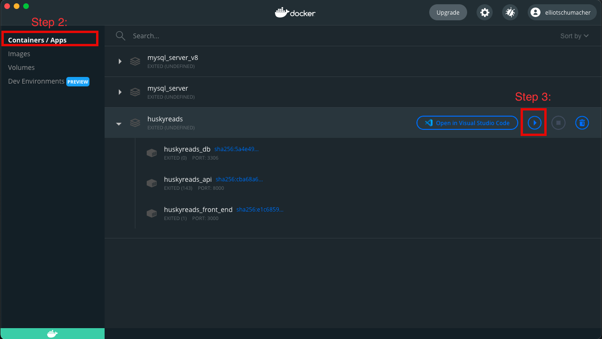
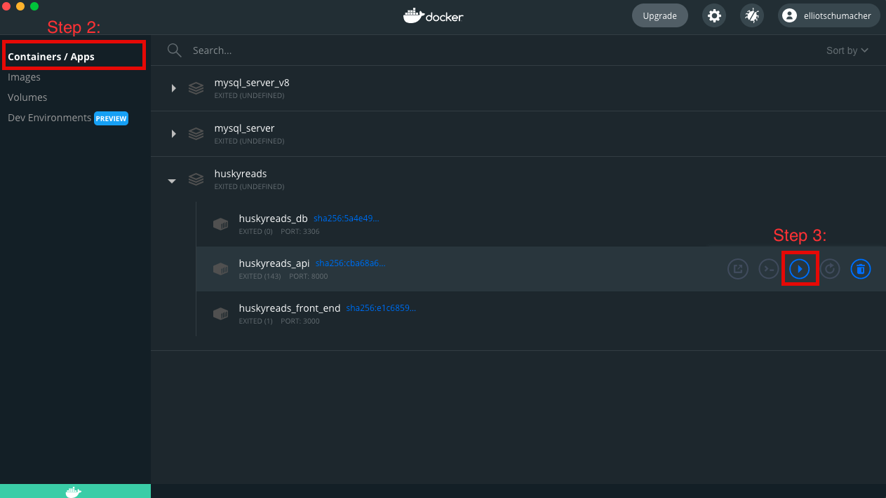

# How to run your code during developement with Docker

## Setting Up Docker Containers

These steps will create all the Docker containers you need to run HuskyReads and start them up.

1. Open a terminal
2. Use `cd` to reach the project directory (`HuskyReads`)
3. Run `docker-compose up --build`

Step 3 runs `npm install` so it may take 2-3 minutes to completely run

---

## Running Docker Containers

### Option 1: Start all containers

1. Open Docker Desktop app
2. Select `Containers / Apps`
3. Click `Start` button for the container group
   
    

### Option 2: Start specific containers

1. Open Docker Desktop app
2. Select `Containers / Apps`
3. Click `Start` button for each container you want to start

    

---

## Installing New Node_Modules

1. Open a terminal
2. Use `cd` to reach to directory with the `package.json that you want to modify.
3. Run `rm -r node_modules/` to delete any existing node_modules. You could also just delete them in VS Code
5. Run `npm install <module_name>` where <module_name> is the name of the module (i.e. axios)
6. 3. Rerun `rm -r node_modules/` to delete the new node_modules folder. You could also just delete it in VS Code
7. You are done. The `package.json` file should now have the new module i